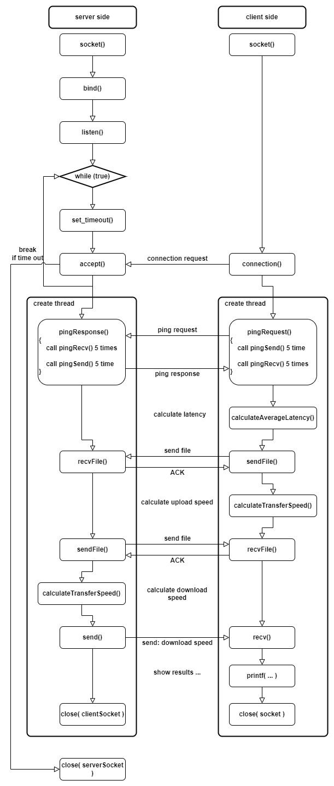

## Objective
It is a simple program for transmission speed test. \
The code also reveal basic socket programming.

## Speed test formula

$$\text{Average Latency} = \frac{\text{Total Round-Trip Time}}{\text{Number of Measurements}}$$

$$\text{Upload Speed} = \frac{\text{Total Data Uploaded}}{\text{Time Taken}}$$

$$\text{Download Speed} = \frac{\text{Total Data Downloaded}}{\text{Time Taken}}$$

## Program flowchart


## How to build
there are two version pthead-version / std-thread-version
```console
$ cd std-thread-version
or
$ cd std-thread-version
```
cmake
```console
$ cd build
$ rm -rf * && cmake .. && make
```

## How to run
server side
```console
$ ./server_side 
Server side listening on port 8080

Received 1048577 bytes

Send 1048576 bytes
```
client side
```console
# can set server ip
$ ./client_side <server_IP>

# default connect to 127.0.0.1
$ ./client_side 

Average latency (micro second): 37.00

Send 1048576 bytes

Received 1048577 bytes

Average latency (micro second): 37.00
Upload Speed (Mbps): 11848.32
Download Speed (Mbps): 199.66
```

## Compare with benchmark
iperf
```console
$ sudo apt-get install iperf3

$ iperf3 -s

$ iperf3 -c <server_IP>

# To measure bandwidth in both directions simultaneously, use the -d option:
$ iperf3 -c <server_IP> -d
```
speedtest-cli
```console
$ wget -O speedtest-cli https://raw.github.com/sivel/speedtest-cli/master/speedtest.py

$ chmod +x speedtest-cli

$ ./speedtest-cli
```
## General concept about socket programming
Socket programming is a way of connecting two nodes on a network to communicate with each other. One socket(node) listens on a particular port at an IP, while the other socket reaches out to the other to form a connection. The server forms the listener socket while the client reaches out to the server. \
ref: https://www.geeksforgeeks.org/socket-programming-cc/

## Set timout for socket
In socket programming with C, you can set timeouts for the send and recv functions. This is useful to prevent your program from hanging indefinitely if the network is slow or unresponsive.
```C
// Set timeout for send
timeout.tv_sec = 3;  // 3 seconds
timeout.tv_usec = 0; // 0 microseconds
if (setsockopt(sockfd, SOL_SOCKET, SO_SNDTIMEO, &timeout, sizeof(timeout)) < 0) {
	perror("setsockopt send");
	exit(EXIT_FAILURE);
}

// Set timeout for recv
if (setsockopt(sockfd, SOL_SOCKET, SO_RCVTIMEO, &timeout, sizeof(timeout)) < 0) {
	perror("setsockopt recv");
	exit(EXIT_FAILURE);
}
```

## Another topic about socket (TCP and UDP server using select)
The Select function is used to select between TCP and UDP sockets. This function gives instructions to the kernel to wait for any of the multiple events to occur and awakens the process only after one or more events occur or a specified time passes.
```C
// Server program 
#include <arpa/inet.h> 
#include <errno.h> 
#include <netinet/in.h> 
#include <signal.h> 
#include <stdio.h> 
#include <stdlib.h> 
#include <strings.h> 
#include <sys/socket.h> 
#include <sys/types.h> 
#include <unistd.h> 
#define PORT 5000 
#define MAXLINE 1024 
int max(int x, int y) 
{ 
	if (x > y) 
		return x; 
	else
		return y; 
} 
int main() 
{ 
	int listenfd, connfd, udpfd, nready, maxfdp1; 
	char buffer[MAXLINE]; 
	pid_t childpid; 
	fd_set rset; 
	ssize_t n; 
	socklen_t len; 
	const int on = 1; 
	struct sockaddr_in cliaddr, servaddr; 
	char* message = "Hello Client"; 
	void sig_chld(int); 

	/* create listening TCP socket */
	listenfd = socket(AF_INET, SOCK_STREAM, 0); 
	bzero(&servaddr, sizeof(servaddr)); 
	servaddr.sin_family = AF_INET; 
	servaddr.sin_addr.s_addr = htonl(INADDR_ANY); 
	servaddr.sin_port = htons(PORT); 

	// binding server addr structure to listenfd 
	bind(listenfd, (struct sockaddr*)&servaddr, sizeof(servaddr)); 
	listen(listenfd, 10); 

	/* create UDP socket */
	udpfd = socket(AF_INET, SOCK_DGRAM, 0); 
	// binding server addr structure to udp sockfd 
	bind(udpfd, (struct sockaddr*)&servaddr, sizeof(servaddr)); 

	// clear the descriptor set 
	FD_ZERO(&rset); 

	// get maxfd 
	maxfdp1 = max(listenfd, udpfd) + 1; 
	for (;;) { 

		// set listenfd and udpfd in readset 
		FD_SET(listenfd, &rset); 
		FD_SET(udpfd, &rset); 

		// select the ready descriptor 
		nready = select(maxfdp1, &rset, NULL, NULL, NULL); 

		// if tcp socket is readable then handle 
		// it by accepting the connection 
		if (FD_ISSET(listenfd, &rset)) { 
			len = sizeof(cliaddr); 
			connfd = accept(listenfd, (struct sockaddr*)&cliaddr, &len); 
			if ((childpid = fork()) == 0) { 
				close(listenfd); 
				bzero(buffer, sizeof(buffer)); 
				printf("Message From TCP client: "); 
				read(connfd, buffer, sizeof(buffer)); 
				puts(buffer); 
				write(connfd, (const char*)message, sizeof(buffer)); 
				close(connfd); 
				exit(0); 
			} 
			close(connfd); 
		} 
		// if udp socket is readable receive the message. 
		if (FD_ISSET(udpfd, &rset)) { 
			len = sizeof(cliaddr); 
			bzero(buffer, sizeof(buffer)); 
			printf("\nMessage from UDP client: "); 
			n = recvfrom(udpfd, buffer, sizeof(buffer), 0, 
						(struct sockaddr*)&cliaddr, &len); 
			puts(buffer); 
			sendto(udpfd, (const char*)message, sizeof(buffer), 0, 
				(struct sockaddr*)&cliaddr, sizeof(cliaddr)); 
		} 
	} 
} 
```
ref: https://www.geeksforgeeks.org/tcp-and-udp-server-using-select/
