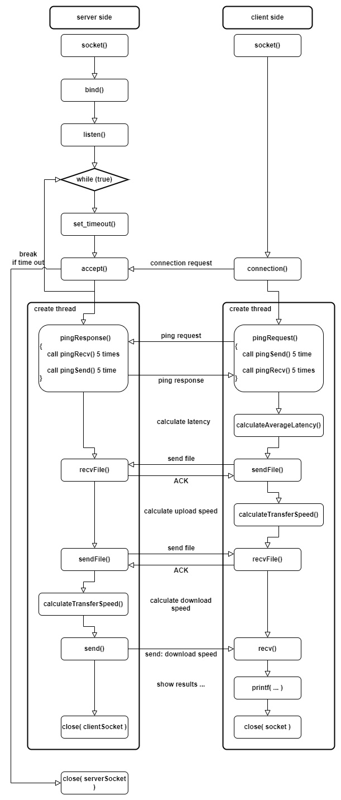

# Objective
It is a simple program for transmission speed test. \
The code also reveal basic socket programming.

# Speed test program 

## Speed test formula

$$\text{Average Latency} = \frac{\text{Total Round-Trip Time}}{\text{Number of Measurements}}$$

$$\text{Upload Speed} = \frac{\text{Total Data Uploaded}}{\text{Time Taken}}$$

$$\text{Download Speed} = \frac{\text{Total Data Downloaded}}{\text{Time Taken}}$$

## Program flowchart


## How to build
there are two version pthead-version / std-thread-version
```console
$ cd std-thread-version
or
$ cd std-thread-version
```
cmake
```console
$ cd build
$ rm -rf * && cmake .. && make
```

## How to run
server side
```console
$ ./server_side 
Server side listening on port 8080

Received 1048577 bytes

Send 1048576 bytes
```
client side
```console
# can set server ip
$ ./client_side <server_IP>

# default connect to 127.0.0.1
$ ./client_side 

Average latency (micro second): 37.00

Send 1048576 bytes

Received 1048577 bytes

Average latency (micro second): 37.00
Upload Speed (Mbps): 11848.32
Download Speed (Mbps): 199.66
```

## Compare with benchmark
iperf
```console
$ sudo apt-get install iperf3

$ iperf3 -s

$ iperf3 -c <server_IP>

# To measure bandwidth in both directions simultaneously, use the -d option:
$ iperf3 -c <server_IP> -d
```
speedtest-cli
```console
$ wget -O speedtest-cli https://raw.github.com/sivel/speedtest-cli/master/speedtest.py

$ chmod +x speedtest-cli

$ ./speedtest-cli
```

# A deeper look about socket
A socket is like a doorway between your application and the network. It's an endpoint for communication between two machines over a network.
\
When two computers (or two programs on the same computer) want to talk, each one uses a socket. These sockets are connected over a network protocol (usually TCP/IP).
\
Please look at [socket.md](socket.md) for more detail explaination about socket and socket programming.